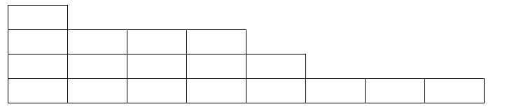

Лесенки  
Лесенкой называется набор кубиков, в котором каждый следующий горизонтальный слой содержит меньше кубиков, чем слой под ним.

Требуется подсчитать количество различных лесенок, которые могут быть построены ровно из N кубиков.

Входные данные  
Вводится одно число N (1⩽N⩽50).

Выходные данные  
Выведите искомое количество лесенок.

Примеры  
Ввод  
3

Вывод  
2